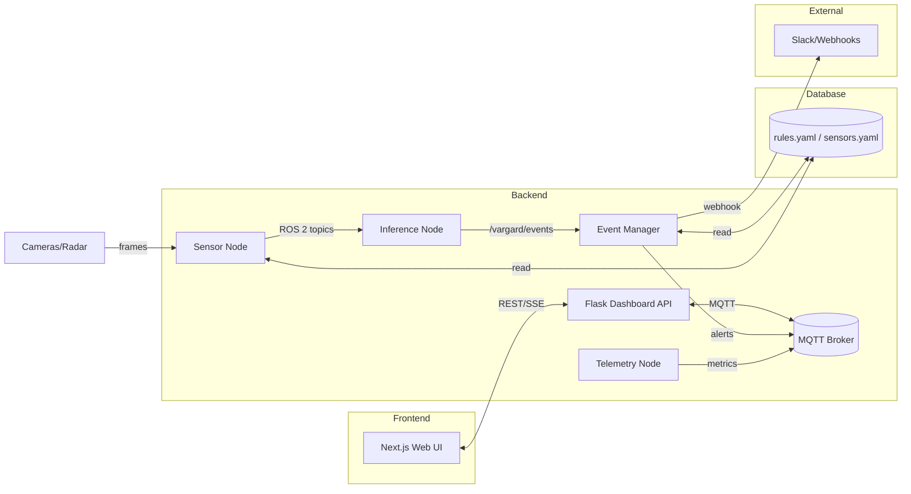

# Vargard Data Flow

```mermaid
flowchart LR
    subgraph Frontend
        Web["Next.js Web UI"]
    end
    subgraph Backend
        Flask["Flask Dashboard API"]
        MQTT[("MQTT Broker")]
        SensorNode["Sensor Node"]
        InferenceNode["Inference Node"]
        EventManager["Event Manager"]
        TelemetryNode["Telemetry Node"]
    end
    subgraph Database
        Config[("rules.yaml / sensors.yaml")]
    end
    subgraph External
        Slack["Slack/Webhooks"]
    end

    Sensors["Cameras/Radar"] -->|"frames"| SensorNode
    SensorNode -->|"ROS 2 topics"| InferenceNode
    InferenceNode -->|"/vargard/events"| EventManager
    TelemetryNode -->|"metrics"| MQTT
    EventManager -->|"alerts"| MQTT
    Flask <--> |"MQTT"| MQTT
    Web <--> |"REST/SSE"| Flask
    EventManager --> |"webhook"| Slack
    SensorNode <-->|"read"| Config
    EventManager <-->|"read"| Config
```
